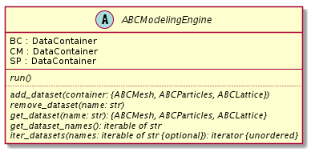
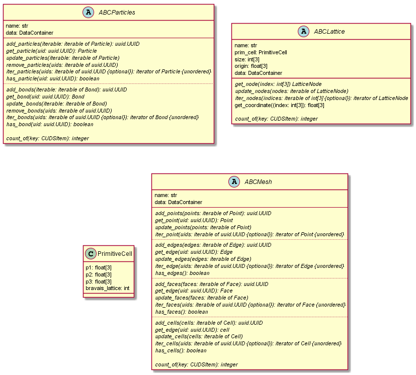
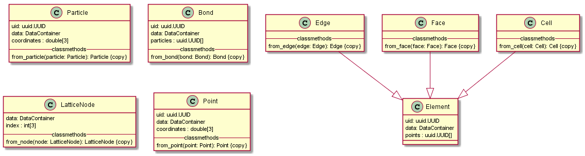
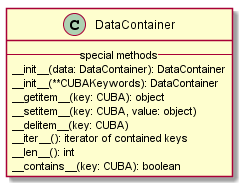
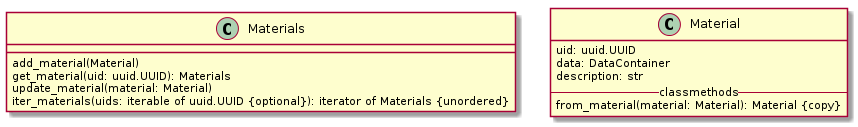

CUDS Data Structures
====================

The Common Unified Data Structures (CUDS) define the expected
interface for the modelling engine wrappers, the visualisation api the
top level CUDS containers (i.e. Mesh, Lattice and Particles) and the
low level CUDS components (e.g Point, Bond, LatticeNode)

.. note::

   The CUDS API is constantly evolving and changes through the processes
   of the SSB and the designated workgroups.

Modelling engine
----------------

  **Figure. 1:** UML description of a CUDS modelling engine.

The CUDS engine supports operations to add, get and remove CUDS
containers from the internal memory of the engine wrapper to setup
the SD state of the simulations.

When a CUDS container is added the CUDS modelling engine will copy
into internal memory only the ``uid`` mapping and the CUBA information
that it can support. The user needs to refer to the wrapper package
to identify what information is retained.

When a CUDS container is returned as a result of a ``get`` operation
in a modelling engine the returned Container is a proxy to the
information stored in the internal memory if the wrapper/modelling
engine.

CUDS containers
---------------

  **Figure. 2:** UML description of a CUDS Containers

The CUDS containers, with the exception of the Lattice, are multi-type
container (i.e. contain different types of objects). For each type the
following operations are currently supported:

* Add an item to the container
* Get an item from the container based on the ``uid``
* Remove an item from the container based on the ``uid``
* Update an item
* Iterate over all or some of the items given an iterable of ``uids``

.. note::

   - Lattice items do not have a ``uid`` but are accessed based on
     ``(i,j,k)`` index tuples.
   - For Mesh and Lattice containers the description does not define
     remove operations.
   - The Lattice container does not have an add item operation.

.. rubric:: Snapshot principle

All CUDS containers (native or proxy based) are owners of their data
and will always return components that contain a copy (snapshot) of
the internal data representation. As a result, the information of an
item extracted with a ``get`` operation before and after a
simulation run is not expected to be the same. The snapshot principle
also means that the returned CUDS items do not depend anymore on the
container instance they where extracted from.

CUDS Items
----------

   **Figure 3:** UML diagram of the CUDS items and their relations.

Low level items are smallest objects that can hold CUBA information in
SimPhoNy simulations. Each CUDS container supports a specific set of
these types as presented in **Fig. 2**.

Core items
----------

   **Figure 4:** UML diagram of the DataContainer.

The CUBA attribute container part of the SimPhoNy core. A dictionary
like object maps :class:`~.CUBA` enum keys to they values. In its
native python implementation it can support all CUBA attributes.

Materials
----------

   **Figure 4:** UML diagram of Materials and Material.

In the SimPhoNy modeling framework, :class:`~.Materials` and :class:`~.Material`
are used to describe materials and to define common material properties. Each
low-level  (e.g. Point, Particle) can be of a certain material.
