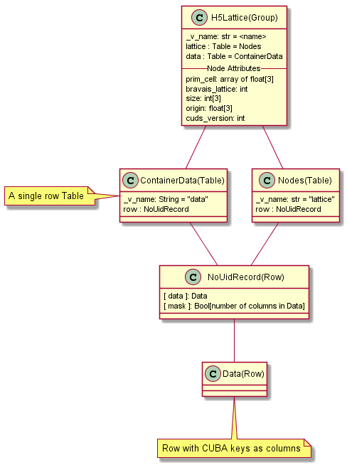
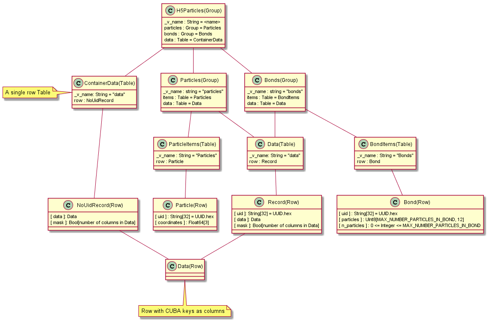
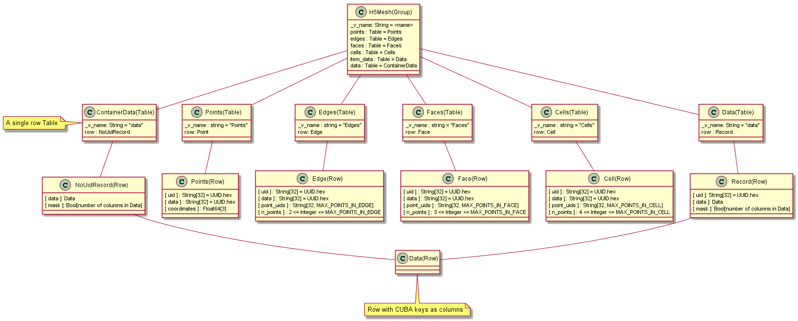

HDF5 Storage
============

Cuds containers can be stored in HDF5 files using the :class:`~.H5File` class. The provided
api is a currently a reduced version of the Modeling Engine api and supports adding and
manipulating CUDS containers. Please also note that returned containers from the get
methods are live proxy objects on top of the HDF5 storage (in contrast to the common
offline save and read operations).

HDF5 Stored Layout
------------------

Data are stored in HDF5 files using a separate layout for each type of CUDS container.
The stored layout of the containers is provided bellow using a pseudo-uml description
for the HDF5 based layout of the data stored in the files.

.. warning::

   This is the provisional storage layout and is under continues development. Backwards
   compatibility is not expected to be supported before version 1.0.0 of the
   simphony-common library.

.. rubric:: Lattice

   **Figure 1:** Diagram of the Lattice based storage.

   The Lattice is stored using two table nodes, one for the container
   `data` attribute and one for the lattice nodes data
   information. The nodes data are stored using the
   ``numpy.ndenumerate`` function to convert from i,j,k lattice
   coordinates to a flat index.

.. rubric:: Particles

   **Figure 2:** Diagram of the Particles based storage.

   The Particles container is stored using one table for the container
   `data` attribute and two groups to holding the particle and bond
   items saperatly. Each item group has two tables one for the item
   information (i.e. particle or bond) and one for the item
   `data`. Indexing into the item and data tables takes place by using
   the same uid hex for both.

.. rubric:: Mesh

   **Figure 3:** Diagram of the Mesh based storage.

   The Mesh container is stored using 6 tables, one for the container
   `data` attribute, one for all the item data information, one for
   the points and one for each type of elements (i.e. edge, face and
   cell). Indexing to the point or element tables is using the item
   uid while the item ``data`` information is accessed using a
   separate set of uids mapping to the entries in the ``data`` table.
